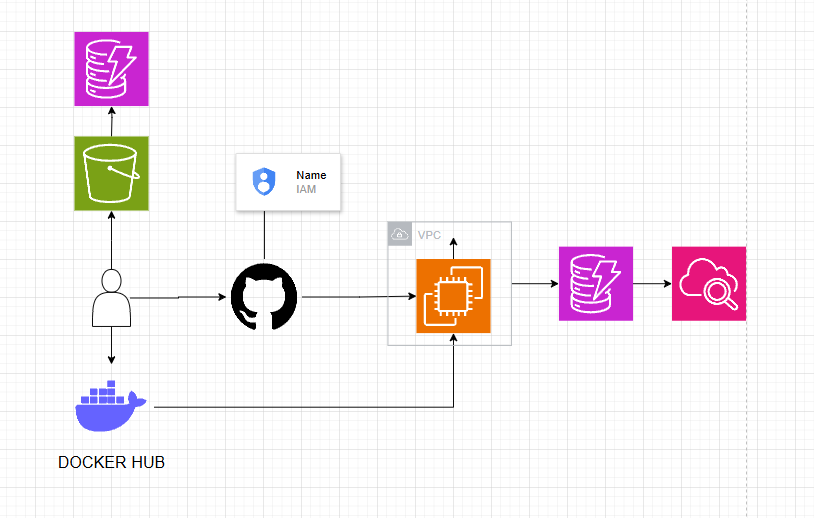
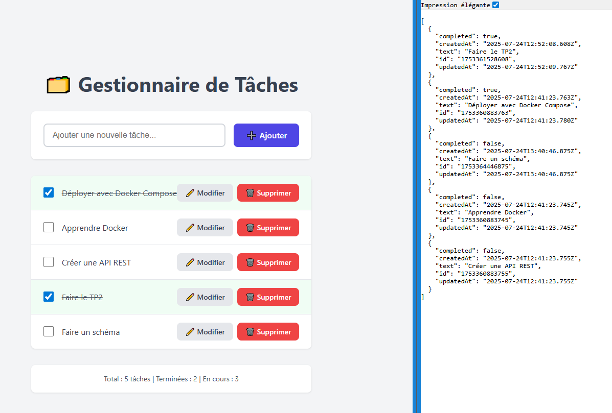

# 🚀 Cloud DevOps Todo App

Todo application with automated AWS deployment using Terraform, Docker, and GitHub Actions.

## 🏗️ Architecture



```
Frontend (React + Vite) → Nginx → Port 80
Backend (Express) → Node.js → Port 3005 → DynamoDB
```



**AWS Infrastructure:**
- EC2 t2.micro
- DynamoDB Table
- S3 Backend for Terraform state
- Security Groups & VPC

## 🚀 Quick Start for New Developers

### 1. **Clone & Setup**
```bash
git clone https://github.com/AznTufu/cloud-devops.git
cd cloud-devops

# Configure AWS CLI
aws configure
```

### 2. **Check if S3 Backend Exists**

#### Windows (PowerShell)
```powershell
# Check if backend exists (reliable method)
$bucket = "cloud-devops-terraform-state-bucket"
aws s3api head-bucket --bucket $bucket 2>$null
if ($LASTEXITCODE -eq 0) {
    Write-Host "✅ Backend exists" -ForegroundColor Green
} else {
    Write-Host "❌ Backend not found" -ForegroundColor Red
}

# Or simple one-liner
aws s3 ls | Select-String "cloud-devops-terraform-state"
```

#### Linux/macOS (Bash)
```bash
# Simple check
aws s3api head-bucket --bucket cloud-devops-terraform-state-bucket 2>/dev/null && echo "✅ Backend exists" || echo "❌ Backend not found"

# Alternative
aws s3 ls | grep cloud-devops-terraform-state
```

### 3. **Deploy Infrastructure**

#### If S3 backend EXISTS (normal case)
```bash
cd infra/terraform
terraform init     # Connects to shared S3 backend
terraform plan
terraform apply
```

#### If S3 backend DOESN'T EXIST (first developer only)
```bash
# Create S3 backend (ONCE PER TEAM)
.\infra\scripts\setup-backend.ps1

# Then deploy infrastructure
cd infra/terraform
terraform init
terraform plan
terraform apply
```

### 4. **Develop Normally**
```bash
git add .
git commit -m "feat: your changes"
git push origin feature-branch

# Create Pull Request to main branch
# → Automatic deployment via GitHub Actions on PR to main
```

## ⚙️ Configuration (First Time Setup)

### GitHub Secrets Required
In your repository → Settings → Secrets and variables → Actions:

| Secret                  | Value                    |
|-------------------------|--------------------------|
| `DOCKER_USERNAME`       | Your Docker Hub username |
| `DOCKER_PASSWORD`       | Your Docker Hub password |
| `AWS_ACCESS_KEY_ID`     | Your AWS access key      |
| `AWS_SECRET_ACCESS_KEY` | Your AWS secret key      |

## 🛠️ Scripts

### S3 Backend Management
```powershell
# Create S3 backend (ONCE per team)
.\infra\scripts\setup-backend.ps1

# Destroy S3 backend (LAST STEP when cleaning up)
.\infra\scripts\destroy-backend.ps1
```

### Application Infrastructure
```bash
# Deploy application to AWS
cd infra/terraform
terraform init     # Connect to S3 backend
terraform plan
terraform apply

# Remove application from AWS (FIRST STEP when cleaning up)  
cd infra/terraform
terraform destroy
```

### Local Development
```bash
# Run locally with Docker Compose
docker-compose up --build
```

## 🔄 CI/CD Pipeline

**Automatic deployment on Pull Request to `main`:**
1. 🔨 Build & Test
2. 🐳 Build & Push Docker images
3. ✅ Verify S3 backend exists
4. 🚀 Deploy to AWS with Terraform

**Access URLs** (shown in GitHub Actions logs):
- Frontend: `http://<PUBLIC_IP>/`
- Backend API: `http://<PUBLIC_IP>:3005/`

## 🗂️ Project Structure

```
.
├── client/                    # React Frontend + Vite
├── server/                    # Express Backend + DynamoDB  
├── infra/
│   ├── backend/               # S3 backend infrastructure
│   ├── terraform/             # Application infrastructure
│   └── scripts/               # Automation scripts
├── .github/workflows/         # CI/CD Pipeline
└── docker-compose.yml         # Local development
```

## 🆘 Troubleshooting

### "Backend not found" error
If the pipeline fails with "Backend S3 not found":
1. Someone needs to run `setup-backend.ps1` first
2. Or run it yourself (once per team)
3. Then retry the push

### Manual Terraform commands
```bash
# See current resources
terraform show

# See outputs (IPs, URLs)
terraform output
```

## 🧹 Complete Project Cleanup

### Full Deployment Cycle (for testing)
```powershell
# 1. Create S3 backend (if doesn't exist)
.\infra\scripts\setup-backend.ps1

# 2. Deploy application infrastructure  
cd infra/terraform
terraform init     # Connect to S3 backend
terraform plan
terraform apply

# 3. Clean everything when done
cd infra/terraform
terraform destroy  # Remove application infrastructure first

# 4. Remove S3 backend (last step)
.\infra\scripts\destroy-backend.ps1
```

### Complete Project Removal
**⚠️ WARNING: This will delete ALL AWS resources and costs money!**

```powershell
# Step 1: Destroy application infrastructure
cd infra/terraform
terraform destroy
# Type 'yes' to confirm

# Step 2: Destroy S3 backend infrastructure (automatically empties bucket)
.\infra\scripts\destroy-backend.ps1
# Type 'yes' to confirm
# Script automatically handles S3 bucket versioning and cleanup

# Verification - should return "not found"
aws s3api head-bucket --bucket cloud-devops-terraform-state-bucket
aws dynamodb describe-table --table-name terraform-state-lock --region eu-west-1
```

**✅ After cleanup, your AWS account will have no remaining resources from this project.**

---

🎯 **Once S3 backend is configured, create a Pull Request to main to deploy to AWS!** 🚀
